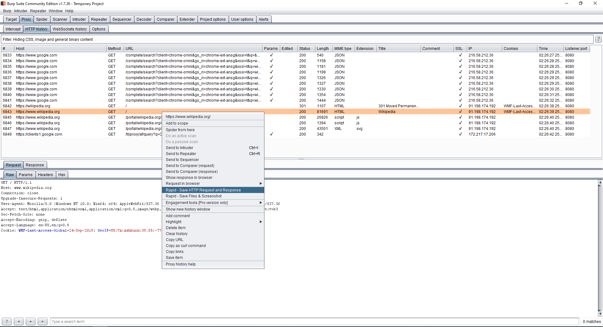
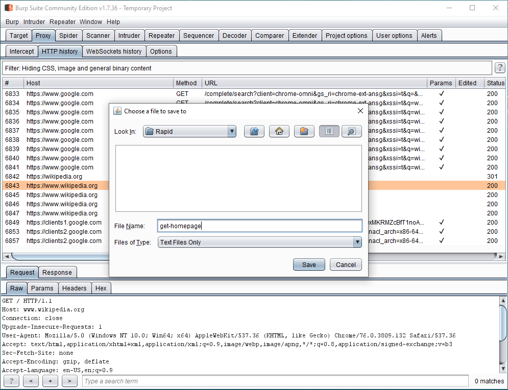
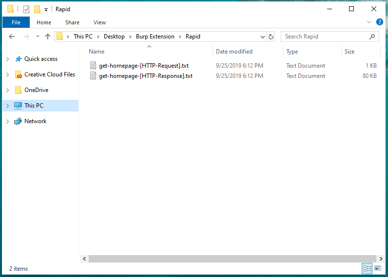
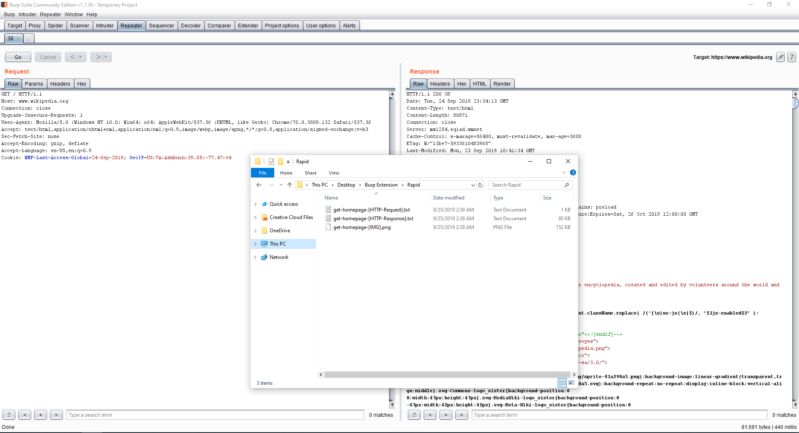

# Rapid

A fairly simple [Burp Suite](https://portswigger.net/burp) extension that enables you to save *HTTP Requests* and *Responses* to files a lot faster and in one go.

## How it works?
Currently there are two options available:

 - Save HTTP Request and Response
 - Save Files & Screenshot
 
 

#### Option #1 - Save HTTP Request and Response
It can save the *HTTP Request* and *Response* to files without you having to type their filenames twice as **Rapid** takes only one input and does the rest automatically.

##### For example, right-click on an element from the HTTP History tab, select 'Rapid - Save HTTP Request and Response', find a destination folder and enter the following filename:

    get-homepage
   
   
   Click ***Save***, and **Rapid** will automatically create the following files:
   

    get-homepage-[HTTP-Request].txt
    get-homepage-[HTTP-Response].txt
    
   
#### Option #2 - Save Files & Screenshot
In addition to only creating the *HTTP Request* and *Response* files, **Rapid** will also capture a screenshot*, give it a name and save it.

Given the input ``` get-hostname ```, **Rapid** will generate the following files in your selected folder:

    get-homepage-[HTTP-Request].txt
    get-homepage-[HTTP-Response].txt
    get-homepage-[IMG].png
   
###
######  \* **Rapid** has been configured (with a 1 second delay) to capture a screenshot of whatever is shown on the screen after you click *Save*.  Make sure that you don't close Burp or switch to another window immediately after clicking *Save*. 

## Installation
Download latest version from Releases
https://github.com/iamaldi/rapid/releases

## License
This project is licensed under GNU GPL v3.0
